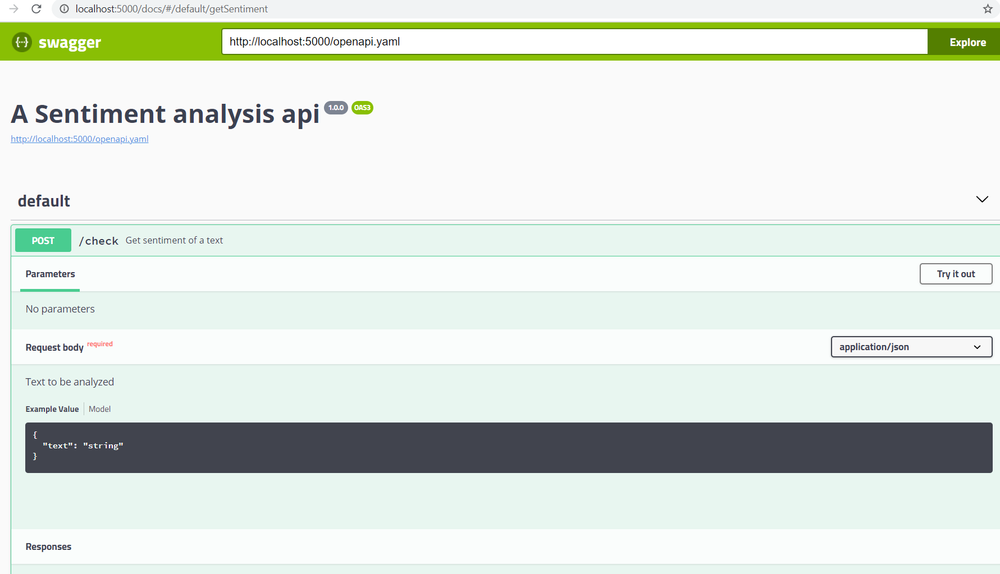

# Object oriented approach for machine learning

## Data
Data used in this project is airline_sentiment_analysis.csv containing 14000+ rows and 2 columns named test contaning test reviews and column airline sentiment contaning sentiment associated with each test respectively.

## Setting Up
* python 3.x

### Dependencies
* scikit-learn
* pandas 
* numpy
* imblearn
* pyramid
* tensorflow (Optional)

To install the depenencies
```
$ pip install -r requirements.txt
```

## Training

- The ML class in ```ml.py``` file present in src folder implenets different options to get started with model traning.
- A GridSearchCV traning can be perfomed with all the listed models in ```ml.py``` by calling the ```train_gridsearch()``` method provided the data after intializing the ```Sentiment_Analysis``` class in ```pipeline.py```
```
import pipeline

SA = pipeline.Sentiment_Analysis()
SA.train_gridseatch(df,sample_data=True,sampling_ratio=(.4,.7),n_splits=5,test_size=.2)
```
- A custom model of choice can be trained with the same data processing pipeline by calling the ```train_model``` method and passing the model as argument after initializing the ```Sentiment_Analysis``` class in ```pipeline.py```
```
import pipeline

model = "Compiled model of your choice"
SA = pipeline.Sentiment_Analysis()
SA.train_model(df,model,sample_data=True,sampling_ratio=(.4,.7),test_size=.2)
```
- Both traning methods accepts sampling_data as boolean, whether to perform SMOTE and Under sampling of majority class can be provied as a tuple to sampling_ratio and a test split size

### Quick train
```
$ cd src
$ python train.py
```


## Inference

- Inference on models can be performed by calling the ```model_inference``` method in ```pipeline.py```.
- When class ```Sentiment_Analysis``` initialized in inference mode providing targets are optional, targets can be provied incase there is requirement for scoring.
```
import pipeline

model = "pretrained model"
SA = Sentiment_Analysis(test=True)
SA.model_inference(model,df,targets=None)
```

```
$ cd src
$ python inference.py
```

## Swagger UI

API endpoints built using pyramid web framework along with **Swagger UI API documentation** is implemented to to serve the pretained ML models

### Run the pyramid app server
```
$ cd src
$ python app.py
```

- pyramid server becomes available at **http://localhost:5000**
- Swagger UI can be accessed at **http://localhost:5000/docs/**




